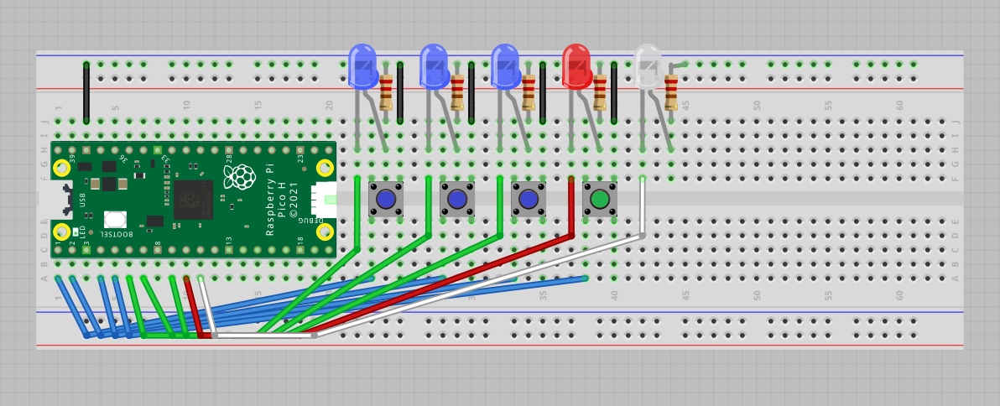

# Binary Code Guesser
A simple script that picks a number between 0 and 7 and asks the user to enter a guess in binary through pushbuttons on a breadboard.
## Build
Although it may look difficult, setting up the circuit is quite easy and doesn't require that much effort. In total, there should be:
* 1 Breadboard
* Raspberry Pi Pico H
* 15 Male-To-Male Jumper Cables
* 5 220 Ohm Resistors
* 3 Blue LEDs
* 1 Red LED
* 1 White LED
* 4 Pushbuttons
* Micro-usb to USB cable (for programming)

## Program
The code for this script is in the file `app.py` in the root directory. Simply download and upload this file to your pico for it to start! If you want this code to run whenever the pico gets powered on, rename the file to either `main.py` or `boot.py`, however `boot.py` will usually run first.
